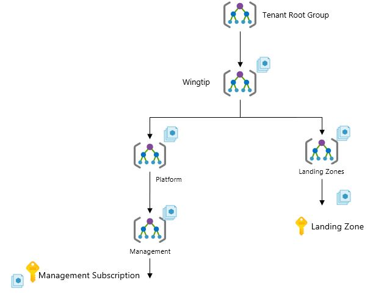

| Enterprise-Scale Design Principles | ARM Template | Scale without refactoring |
|:-------------|:--------------|:--------------|
|| | Yes |

# Deploy Enterprise-Scale lite

## Customer profile

This reference implementation is ideal for customers that are new to Azure and are expecting a minimal footprint intially, and wants to have a more traditional operating model that will favor reactive vs proactive approach when it comes to deploying and operating the platform and landing zones.

## How to evolve and add support for hybrid connectivity later
This reference implementation is ideal for customers who want to start with Landing Zones for their workload in Azure, where hybrid connectivity to their on-premise datacenter is not required from the start.

## How to evolve and become more proactive and enable autonomy for platform and landing zones later?
As customers matures on their Azure journey, they can gradually start to assign more proactive policies (using 'deny' and 'deployIfNotExist' effect), which will reduce the need to perform manual operations when new landing zones are created, and new workloads are being deployed.

## Pre-requisites
To deploy this ARM template, your user/service principal must have Owner permission at the Tenant root.
See the following [instructions](https://docs.microsoft.com/en-us/azure/role-based-access-control/elevate-access-global-admin) on how to grant access.

## What will be deployed?
- A scalable Management Group hiearchy aligned to core platform capabilities, allowing you to operationalize at scale using RBAC and Policy
- Azure Policies that will audit resource copmliance
- (Optional) An Azure Subscription dedicated for Management, which will serve as a placeholder for core platform capabilities at scale such as security, auditing, and logging
- Landing Zone Management Group applications which doesn't require hybrid connectivity. This is where you will create your Subscriptions that will host your online workloads, that is either deployed by central team or by application team, subject to the RBAC you will be assigning.

---

## Customer design journey and scope

Contoso, Ltd. is a multi-national business with headquarters in London, UK. Contoso Senior leadership has mandated a "Cloud-First" approach, with an overarching strategy to reduce and gradually divest the on-premises datacenter footprint. Contoso has chosen Azure as their preferred public cloud provider. They have a large overall IT estate and are concerned about the velocity of workload transformation/migration, and how they can establish Landing Zones for application teams to migrate their applications.

Contoso has come across the Enterprise-Scale architecture which provides a forward looking Azure-native design approach. The Contoso IT leadership team has committed to this as they believe it will allow applications (legacy or modern) to seamlessly move at their own pace while also providing secure and streamlined operations, management, and governance across the entire Contoso platform on Azure.

## Next steps

Once you have deployed, you can create a new subscription, or move an existing subscription to the Landing Zone management group (Online), and start deploying your workload.
